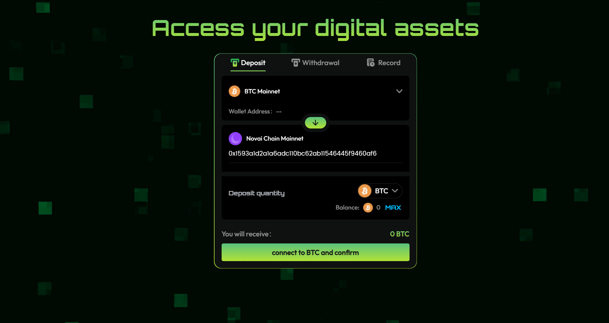
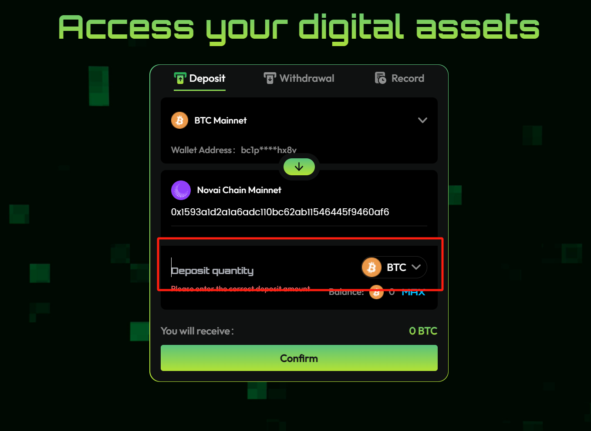

import '../../../../src/css/img.scss'

# Bridge from Bitcoin to NOVAI

[NOVAI Gateway](https://bridge.novaichain.com/#/) lets you stake, swap, or lend your bitcoin from a single, unified interface so you can put your bitcoin to work earning yield faster than ever before.

It's built on a trustless, RFQ-based cross-chain swap protocol that connects professional LPs with users through a seamless swapping experience. Essentially, LPs handle the complexities of bridging and staking on behalf of users in exchange for a fee.

## Step-by-Step Guide

1. Open the [NOVAI Gateway website](https://bridge.novaichain.com/#/).

2. Select the Bitcoin network by clicking "The red frame" and then selecting "BTC Mainnet" from the list.

3. clicking "connect to BTC and confirm" to Switch and connect your wallet.

4. Type the amount of BTC that you would like to bridge from Bitcoin to NOVAI, Then clicking”confirm”.

