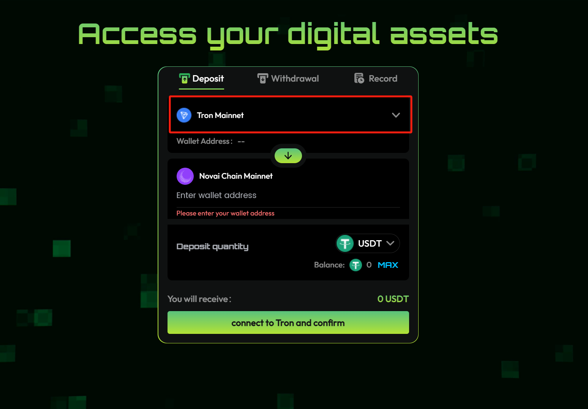
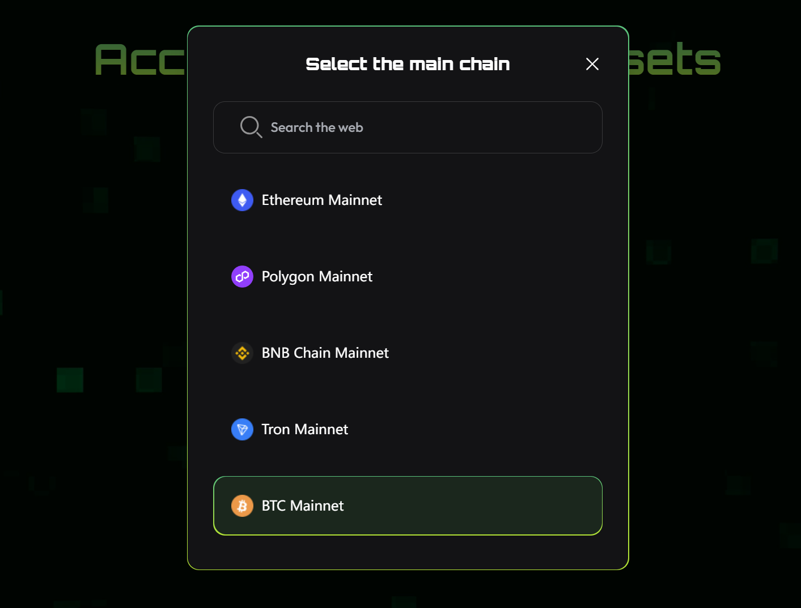
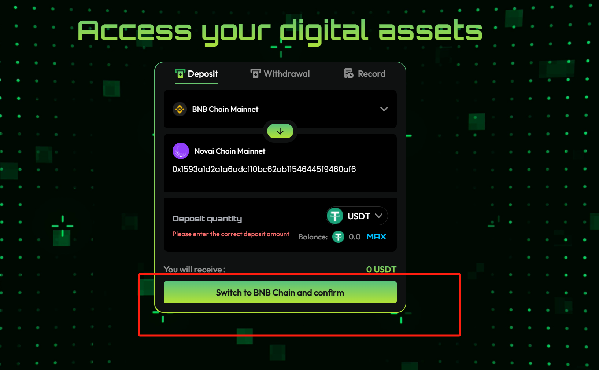
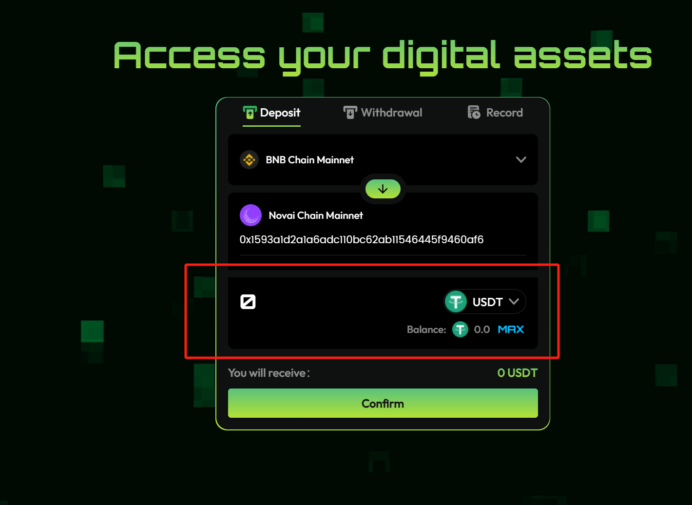

import '../../../../src/css/img.scss'

# Bridge from EVM Chains to NOVAI

The [NOVAI Bridge](https://bridge.novaichain.com/#/) allows you to move ETH between EVM Chains and NOVAI.

## Step-by-step Guide

1. The [NOVAI Bridge](https://bridge.novaichain.com/#/) allows you to move USDT between EVM chains and NOVAI.

2. Select the Network you want by clicking "The red frame" and then selecting from the list.

3. Clicking "red frame" to Switch and connect your wallet.

4. Type the amount of USDT that you would like to bridge from this chain to NOVAI, Then clicking”confirm”.

